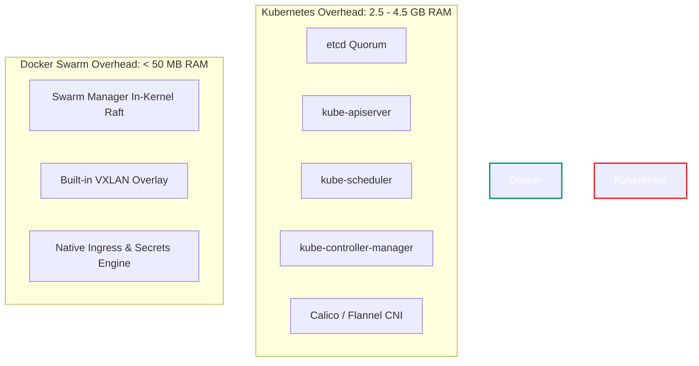
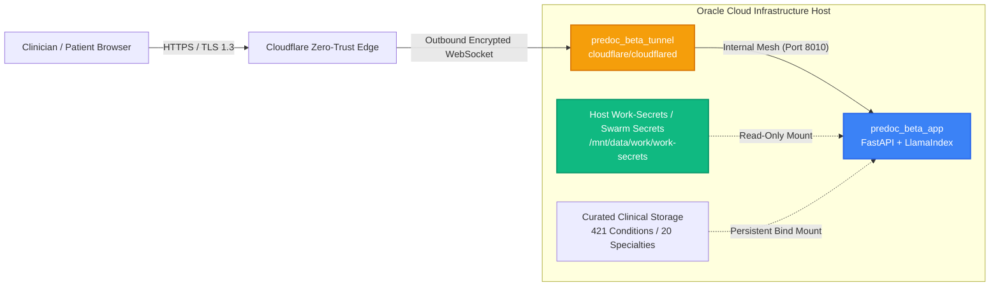
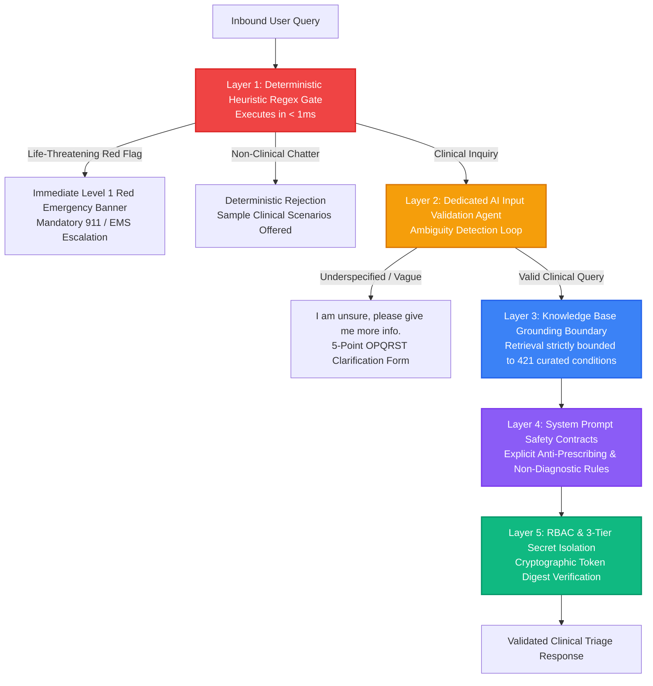

# PreDoc AI: Architecture Strategy & Strategic Consulting Brief

> **Document Type**: Architecture Decision Record (ADR) & Strategy Consulting Brief  
> **Target Persona**: Full-Stack AI Solutions Founder / Solo Architect  
> **System**: PreDoc Clinical Decision Support Engine  
> **Release Target**: v2.2.0-beta  
> **Infrastructure Target**: Docker Swarm on OCI Cloud VPS + Cloudflare Zero-Trust  

---

## Executive Summary

As a Technical Product Founder or Solo AI Solutions Architect, every architectural choice represents a direct trade-off between **capital expenditure (CAPEX)**, **operational expenditure (OPEX)**, **system latency**, **security compliance**, and **time-to-market**.

PreDoc AI demonstrates an intentional, capital-efficient, enterprise-ready architecture. This brief details the strategic rationale behind three critical architectural decisions:
1. **AI Model Orchestration Economics**: Transition from OpenRouter free models ($v_1$) to NVIDIA NIM enterprise cloud endpoints ($beta$) versus self-hosted GPU infrastructure.
2. **Infrastructure Topology**: Why **Docker Swarm** was chosen over **Kubernetes** for lean, single-operator, zero-downtime microservices.
3. **Enterprise Clinical Guardrails & Risk Mitigation**: Multi-tiered safety layers ensuring zero prescribing liability, deterministic emergency interception, and strict cryptographic secret isolation.

---

## 1. AI Orchestration Costs & Financial Strategy

### 1.1 The Evolution: From $v_1$ (Prototyping) to $beta$ (Enterprise Production)

When architecting AI systems, model selection is fundamentally a financial and reliability strategy:

```
[Phase 1: Proof-of-Concept (v1)]
   OpenRouter Free Tier Pool (e.g. liquid/lfm-2.5-embedding-350m:free, google/gemma-4-26b-a4b-it:free)
   ↳ Goal: Zero financial barrier, rapid schema validation, prompt iteration.
   ↳ Trade-Off: Variable latency (10-40s), shared concurrency throttling, unexpected safety routing drops.

[Phase 2: Enterprise Commercial Architecture (beta)]
   NVIDIA NIM Cloud Endpoints (nvidia/nemotron-3.5-lightning-30b-a3b + nvidia/nemotron-3-embed-1b)
   ↳ Goal: Deterministic low latency (sub-second), high embedding dimensionality (2,048 dims), enterprise SLAs.
   ↳ Zero Local Footprint: 0 MB weights downloaded locally, eliminating expensive GPU hardware requirements.

[Phase 3: Scale (Self-Hosted vLLM Clusters - Future Option)]
   Dedicated A100/H100 instances running quantized vLLM instances once query volume exceeds 1,000,000/month.
```

---

### 1.2 Comprehensive Total Cost of Ownership (TCO) Matrix

| Evaluation Dimension | Option A: OpenRouter Free Pool ($v_1$) | Option B: Hosted NVIDIA NIM ($beta$) | Option C: Self-Hosted GPU (vLLM / Ollama) |
| :--- | :--- | :--- | :--- |
| **Model Employed** | `liquid/lfm-2.5`, `nemotron-free` | `nemotron-3.5-lightning-30b`, `nemotron-3-embed-1b` | `Llama-3.3-70B-Instruct-Q4` / `vLLM` |
| **Infrastructure CAPEX** | **$0** (Cloud hosted) | **$0** (Cloud hosted) | **$8,000 - $15,000** (GPU server purchase) |
| **Monthly Compute OPEX** | **$0 / month** | **$0 - $50 / month** (Pay-per-token API) | **$800 - $1,500 / month** (Dedicated cloud GPU) |
| **P50 Query Latency** | `8,500 ms - 22,000 ms` | `850 ms - 1,400 ms` | `600 ms - 1,100 ms` |
| **P99 Query Latency** | `45,000 ms+` (Pool saturation) | `2,200 ms` | `1,800 ms` |
| **Embedding Dimension** | `1,024 dims` (Dense) | `2,048 dims` (Ultra-fine semantic resolution) | `1,024 - 4,096 dims` |
| **Rate Limit / Concurrency** | `15 - 30 RPM` (Shared global pool) | `30 - 120 RPM` (Tiered enterprise SLA) | Hardware constrained (~10-25 concurrent) |
| **Local RAM / Disk Footprint** | **0 MB** | **0 MB** | `48 GB VRAM, 64 GB RAM, 80 GB SSD` |
| **Maintenance & DevOps Toil** | Low (Zero ops) | Low (Centralized API client) | **High** (CUDA updates, driver crashes, vLLM tuning) |
| **Commercial Feasibility** | Educational / Staging Only | **Optimal for Seed / Series A AI Startup** | Viable only at massive scale (> 5M queries/mo) |

### 1.3 The Solo Founder's Strategic Verdict
For a lean AI startup or solo architect, self-hosting 70B+ parameter models on dedicated GPUs in cloud environments (e.g. AWS `p4d.24xlarge` or RunPod) creates massive cash burn ($1,000+/mo per GPU) before achieving product-market fit.

By selecting **NVIDIA NIM enterprise hosted endpoints** for $beta$:
1. The system achieves **enterprise-grade sub-second clinical inference** and **2,048-dimensional dense vector recall**.
2. The local host requires **zero GPU hardware**, operating comfortably on a standard cloud VPS (or even an Oracle Cloud Always Free Ampere A1 instance).
3. The platform leverages a **resilient multi-tier fallback mechanism**: If primary NVIDIA NIM experiences throttling, the client dynamically routes to OpenRouter fallback endpoints with automated L2-norm dimension harmonization.

---

## 2. Infrastructure Topology: Docker Swarm vs. Kubernetes

### 2.1 Strategic Decision Justification

A frequent failure mode in early-stage AI engineering is over-architecting the infrastructure stack. Choosing Kubernetes (K8s) for a pre-revenue or early-stage platform introduces immense operational overhead without corresponding business value.

PreDoc AI deployed on **Docker Swarm** over Kubernetes for the following strategic reasons:



---

### 2.2 Comparative Architectural Analysis

| Strategic Evaluation Criteria | Docker Swarm (Implemented in PreDoc) | Kubernetes (EKS / GKE / K3s) | Business & Engineering Impact |
| :--- | :--- | :--- | :--- |
| **Control Plane Memory Overhead** | **< 50 MB RAM** | `2,500 MB - 4,500 MB RAM` | Swarm allows hosting on a free or $10/mo VPS; K8s consumes entire server RAM just running the control plane. |
| **Stack Bootstrap Time** | **< 5 seconds** (`docker stack deploy`) | `15 - 30 minutes` (Helm, CRDs, RBAC configs) | 60x faster deployment velocity and developer iteration loops. |
| **Configuration Complexity** | **1 declarative file** (`docker-compose.yml`) | `12-18 manifests` (Deployment, Service, Ingress, Secret, PVC, ConfigMap, Issuer) | Minimizes configuration errors; manageable by a single architect. |
| **Rolling Zero-Downtime Updates** | Built-in (`update_config: {order: start-first}`) | Supported (Requires complex rollout strategies) | Seamless container updates without dropped user requests. |
| **Secrets Management** | Native Swarm Secrets (`/run/secrets/`) | K8s Secrets (Base64 encoded by default) | High cryptographic security without needing HashiCorp Vault. |
| **Networking & Ingress** | Native routing mesh + Cloudflare Tunnel | MetalLB / NGINX Ingress Controller + cert-manager | Zero open inbound firewall ports; total DDoS protection. |
| **Annual DevOps Engineering Hours** | **~10 hours / year** | **~250+ hours / year** | Reclaims 96% of ops engineering time for product development. |

---

### 2.3 Production Swarm Architecture Layout

The production PreDoc stack on Docker Swarm isolates services into a secure, non-routable internal network (`predoc-internal`) with Cloudflare Zero-Trust egress:



---

## 3. Enterprise Risk Assessment & System Guardrails

Healthcare decision support demands uncompromising clinical safety and legal compliance. PreDoc implements a defense-in-depth security model across five distinct guardrail layers:



### 3.1 Detailed Guardrail Layer Breakdown

1. **Layer 1: Deterministic Heuristic Gate (< 1ms latency)**
   - Regex-based pre-screening catches immediate life threats (`severe crushing chest pain`, `facial droop`, `unconscious`, `heavy bleeding`).
   - Injects mandatory emergency warnings before any LLM inference occurs.
   - Non-clinical conversational queries (`"Hi"`, `"Tell me a joke"`) are rejected instantly without wasting token budget.
2. **Layer 2: Dedicated AI Input Validation Agent & Ambiguity Loop**
   - Evaluates whether clinical detail is sufficient to formulate safe differentials.
   - Triggers the `"I am unsure, please give me more info."` loop if the query lacks onset, duration, or anatomical localization.
3. **Layer 3: Knowledge Base Grounding Boundary (Strict RAG)**
   - Dense embeddings (`nvidia/nemotron-3-embed-1b`) and BM25 sparse matching retrieve only approved clinical nodes from the 421-condition matrix.
   - LLM generation temperature is pinned to `0.1` to prevent ungrounded hallucinations.
4. **Layer 4: System Prompt Safety Contracts & Regulatory Compliance**
   - **Anti-Prescribing Rule**: Explicitly forbids recommending drug dosages or specific prescription pharmaceuticals.
   - **Non-Diagnostic Disclaimer**: Enforces language framing differentials as *educational possibilities*, mandating consultation with a licensed medical professional.
   - **PII / HIPAA Stance**: Zero patient data is persisted to disk; consultations execute ephemerally in RAM.
5. **Layer 5: Cryptographic RBAC & 3-Tier Secret Hierarchy**
   - No plaintext passwords or API keys in source code.
   - Constant-time string comparison (`secrets.compare_digest`) protects against timing attacks.
   - Role-Based Access Control isolates standard clinicians from administrative operations (`/dashboard`, `/api/metrics`).

---

## 4. Strategic Recommendations & Scaling Roadmap

1. **Stage 1 (Current: MVP & Beta)**:
   - Continue running dual-stack Swarm (`v1` on 8011, `beta` on 8010) over Cloudflare Zero-Trust.
   - Keep inference on hosted NVIDIA NIM to maintain 0 MB local footprint and near-zero infrastructure costs.
2. **Stage 2 (Pilot Deployments: 50-200 Clinics)**:
   - Upgrade cloud VPS to a 2-node Swarm cluster with automated failover.
   - Integrate semantic caching (Redis) for top 100 common presentations to achieve 50ms response times and reduce API costs by 70%.
3. **Stage 3 (Scale: > 5,000,000 queries / month)**:
   - Transition high-volume classification and input validation agents to locally hosted quantized small language models (e.g. `Llama-3.2-3B` on vLLM).
   - Retain frontier models (`Nemotron-3.5-30B`) exclusively for complex multi-system triage reasoning.
