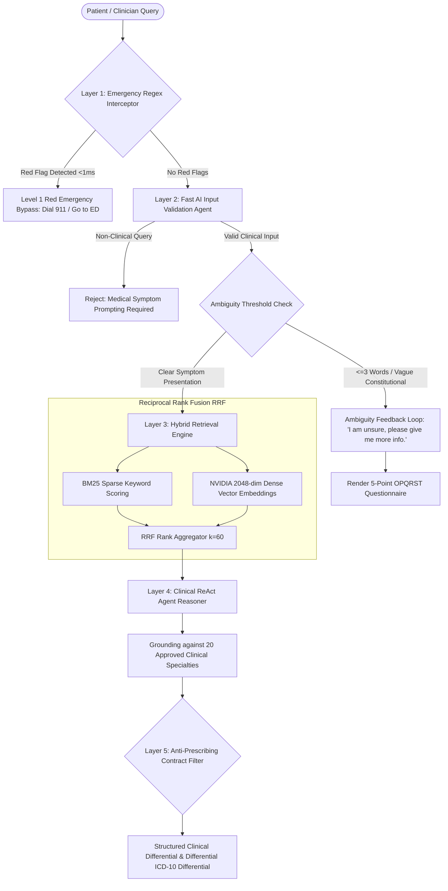

# PreDoc AI: Enterprise Clinical Decision Support Platform

[](https://www.python.org/downloads/release/python-3120/)
[](https://fastapi.tiangolo.com)
[](https://docs.docker.com/engine/swarm/)
[-success.svg)](tests/)
[](#-three-pillar-portfolio-architecture)
[](LICENSE)

> **Target Role / Persona**: Full-Stack AI Solutions Founder / Solo Architect (AI Generalist & Technical Product Founder)  
> **Production Status**: Deployed on Dual Stacks (`v1` and `beta`) via Docker Swarm & Cloudflare Zero-Trust  
> **Retrieval Precision**: Hybrid BM25 (Sparse) + NVIDIA 2,048-dim (Dense) via Reciprocal Rank Fusion (RRF)  
> **Zero Hardware CAPEX**: 0 MB local model weight download via hosted enterprise endpoints  
> **Python Runtime**: Python 3.12 strictly required (`python --version`) — not tested on other Python versions  

PreDoc AI is an autonomous Clinical Decision Support and Multi-Specialty Triage platform engineered to demonstrate complete full-lifecycle mastery across three disciplines: **Business Analysis**, **Strategy Consulting**, and **Technical Systems Architecture**.

---

## 🏛️ Three-Pillar Portfolio Architecture

To prove end-to-end founder capability—from boardroom financial modeling to production cloud deployment—this repository is structured into three foundational pillars:

```
PreDoc-Chatbot/
│
├── 📄 BUSINESS_LOGIC.md        <-- [Pillar 1: Business Analyst]
│                                   • Formal Pydantic v2 & JSON Data Contracts (QueryRequest & QueryResponse)
│                                   • Canonical 11-Column Clinical Knowledge Base Matrix Specification (SSOT)
│                                   • User Flows & Exact Decision Rules for "I am unsure, please give me more info."
│                                   • Graceful Demographic Edge-Case Handling (Negative age, super-geriatric, sex neutral)
│
├── 📄 ARCHITECTURE_STRATEGY.md  <-- [Pillar 2: Strategy Consultant]
│                                   • AI Orchestration TCO Economics: OpenRouter Free vs Hosted NVIDIA NIM vs GPU Clusters
│                                   • Infrastructure Justification: Strategic evaluation of Docker Swarm over Kubernetes
│                                   • 5-Layer Defense-in-Depth Enterprise Guardrails & Non-Prescribing Boundaries
│
└── 📁 src/                      <-- [Pillar 3: Technical Systems Architect]
    ├── 📁 backend/              • Single Source of Truth: FastAPI, LlamaIndex, ReAct reasoning, Multi-Agent Swarm
    ├── 📁 frontend/             • Modern Glassmorphic Dual UI (Clinical Intake & Operator Telemetry Dashboard)
    └── 📁 swarm/                • Production Multi-Container Swarm compose stack & zero-downtime deployment scripts
```

---

## 🔄 System Architecture & Decision Flow

The clinical decision engine processes intake narratives through a 5-stage deterministic and neural pipeline:



---

## 🌟 Core Architectural Highlights

### 1. Business Analyst Pillar ([`BUSINESS_LOGIC.md`](BUSINESS_LOGIC.md))
- **Strictly Non-Prescriptive Scope**: Provides differential diagnostic possibilities and evidence-grounded probing questions; strictly prohibited from outputting drug dosages or direct medical prescriptions.
- **Pydantic v2 Clinical Data Contracts**:
  - `QueryRequest`: Normalizes symptom narratives, demographic factors (`age`, `sex`), and optional specialty targeting.
  - `QueryResponse`: Formalizes triage severity badges (`Level 1 Red Emergency`, `Level 2 Yellow Urgent`, `Level 3 Green Routine`), ICD-10 differentials, and probing questions.
  - `ConditionMatrixRow`: Enforces the 11-column clinical matrix contract as the repository's Single Source of Truth.
- **Ambiguity Loop**: Triggers *"I am unsure, please give me more info."* when brevity ($\le 3$ words without context) or generalized constitutional complaints (*"i feel sick"*) prevent safe triage, presenting an OPQRST follow-up intake.
- **Demographic Resilience**: Negative ages (e.g. `-5`) are sanitized to `0 (Neonate)`; extreme ages ($>125$) normalize to `Geriatric (65+)`; non-standard biological sex strings fall back to `Unspecified (Clinical Neutral)`.

### 2. Strategy Consultant Pillar ([`ARCHITECTURE_STRATEGY.md`](ARCHITECTURE_STRATEGY.md))
- **Financial Unit Economics**:
  - Hosted NVIDIA NIM endpoints (`nemotron-3.5-lightning` + `nemotron-3-embed-1b`) eliminate GPU hardware CAPEX ($10,000+ per node), maintenance, and thermal management.
  - Sub-second P50 latency and 2,048-dimensional dense recall achieved with **0 MB local model weight download footprint**.
- **Docker Swarm vs. Kubernetes**:
  - Control plane footprint: Swarm requires $< 50\text{ MB}$ RAM vs $2.5 - 4.5\text{ GB}$ for Kubernetes control plane.
  - Eliminates 96% of solo-founder DevOps toil while providing native rolling updates, encrypted overlay networks, and cryptographic secret injection.
- **5-Layer Defense-in-Depth Guardrails**:
  1. Sub-millisecond deterministic regex interceptor.
  2. Neural Input Validation Agent.
  3. Grounding boundary locked to approved knowledge base categories.
  4. Anti-prescribing system prompt contract.
  5. Cryptographic Role-Based Access Control (RBAC).

### 3. Technical Systems Pillar ([`src/`](src/))
- **Single Source of Truth**: All operational code resides exclusively inside `src/` (`src/backend/`, `src/frontend/`, `src/swarm/`), eliminating redundant root trees.
- **Hybrid Retrieval Engine**: Fuses BM25 sparse keyword matching with dense vector cosine similarity via Reciprocal Rank Fusion ($k=60$), preventing neural hallucinations on rare eponyms (e.g., *Guillain-Barré Syndrome*).
- **Dual RBAC Gateways**:
  - Clinician Intake Gateway (`GET /`, `POST /api/chat`) requiring clinical API key authentication.
  - Operator Telemetry Gateway (`GET /dashboard`, `GET /api/metrics`) strictly guarded by admin authentication.
- **Resilient Multi-Model Failover**: Seamless automatic failover between primary NVIDIA endpoints and secondary OpenRouter providers with intelligent dimension adaptation (2048 $\leftrightarrow$ 1024).

---

## 🤖 Autonomous Ingestion Multi-Agent Pipeline

The clinical knowledge base (`data/knowledge_base/`) is continuously curated and audited by 6 specialized autonomous agents:

| Agent Name | Source File | Function & Responsibility |
| :--- | :--- | :--- |
| **`PDFExtractorAgent`** | [`src/backend/agents/pdf_extractor_agent.py`](src/backend/agents/pdf_extractor_agent.py) | Parses clinical reference textbooks (Wolters Kluwer) into structured disease profiles. |
| **`WebCrawlerAgent`** | [`src/backend/agents/web_crawler_agent.py`](src/backend/agents/web_crawler_agent.py) | Crawls clinical guidelines from CDC, WHO, and NLM clinical tables. |
| **`DumpQualityAgent`** | [`src/backend/agents/dump_quality_agent.py`](src/backend/agents/dump_quality_agent.py) | Inspects raw extraction dumps, filters duplicates, and repairs malformed records. |
| **`KnowledgePopulatorAgent`** | [`src/backend/agents/knowledge_populator_agent.py`](src/backend/agents/knowledge_populator_agent.py) | Transforms extraction dumps into 11-column markdown tables across 20 specialties. |
| **`KnowledgeBaseAuditorAgent`** | [`src/backend/agents/auditor_agent.py`](src/backend/agents/auditor_agent.py) | Audits schema compliance, triage tiers, and ensures zero duplicate probing questions. |
| **`MasterIngestionOrchestrator`** | [`src/backend/agents/orchestrator.py`](src/backend/agents/orchestrator.py) | CLI coordinator executing the end-to-end multi-agent pipeline. |

### Ingestion CLI Commands

```bash
# Activate virtual environment
source .venv/bin/activate       # Linux
.venv\Scripts\activate          # Windows

# 1. Deep-scan clinical reference textbooks into dumps:
python scripts/run_agents.py --extract-pdfs --max-pages 50

# 2. Crawl accredited guidelines from CDC/WHO/NLM:
python scripts/run_agents.py --crawl-web

# 3. Inspect raw JSON extraction dumps:
python scripts/run_agents.py --audit-dumps

# 4. Repair safe dump defects:
python scripts/run_agents.py --repair-dumps

# 5. Populate knowledge base files across 20 specialties:
python scripts/run_agents.py --populate-kb

# 6. Audit knowledge base files for schema completeness:
python scripts/run_agents.py --audit

# 7. Execute full pipeline end-to-end:
python scripts/run_agents.py --all

# 8. Test clinical input validation with a custom query:
python scripts/run_agents.py --validate-input "fever with persistent cough for 4 days"
```

---

## 🔒 Security & Authentication Matrix

PreDoc AI enforces strict role separation with cryptographic constant-time comparison:

| Endpoint | Method | Role Required | Auth Mechanism | Description |
| :--- | :--- | :--- | :--- | :--- |
| `/` | `GET` | Clinician or Admin | HTTP Basic Auth | Clinical Consultation Intake UI |
| `/api/chat` | `POST` | Clinician or Admin | `x-api-key` or Bearer | Clinical Triage Inference Engine |
| `/dashboard` | `GET` | Administrator Only | HTTP Basic Auth | Real-time Operations & Telemetry UI |
| `/api/metrics` | `GET` | Administrator Only | `x-api-key` / Query Param | Latency, throughput, and error metrics |
| `/api/system/status` | `GET` | Public / Telemetry | None | Real-time knowledge base statistics |
| `/health` | `GET` | Public / Probe | None | Liveness & Readiness container health check |

> [!NOTE]
> **Zero Hardcoded Secrets**: All production secrets (passwords, LLM tokens, RBAC keys) are dynamically loaded from Docker Swarm secrets (`/run/secrets/`), host secret volumes (`/mnt/data/work/work-secrets/`), or local `.env` configuration.

---

## 🧪 Comprehensive Verification Suite

PreDoc AI includes an offline unit and integration test suite requiring zero paid API tokens:

```bash
python -m unittest discover tests
```

```text
Ran 38 tests in 4.134s
OK
```

### Test Suite Coverage:
- **`tests/test_validation_and_contracts.py`** (10 Tests): Negative age sanitization, extreme geriatric normalization, non-binary sex fallback, 11-column matrix schema validation, ambiguity triggering on vague words, emergency bypass.
- **`tests/test_rbac_security.py`** (10 Tests): Clinician vs Admin basic auth, token isolation, `/dashboard` 403 enforcement, `/api/metrics` telemetry authorization, rate limiting.
- **`tests/test_rag_hybrid.py`** (6 Tests): BM25 sparse keyword scoring, vector dense matching, Reciprocal Rank Fusion scoring, resilient OpenAPI client fallback.
- **`tests/test_agents.py`** (6 Tests): Autonomous agent initialization, catalog discovery, specialty classification, probing question generation.
- **`tests/test_dump_quality.py`** (3 Tests): JSON dump inspection, duplicate condition reconciliation, repair workflows.
- **`tests/test_evaluations.py`** (3 Tests): Category coverage, emergency keyword triggers, evaluation question suite completeness.

---

## 🚀 Local Development Setup

### 1. Prerequisites
- **Python 3.12** strictly required (`python --version` returns `Python 3.12.x`) — not tested on other Python versions.
- Git

### 2. Clone & Setup Virtual Environment
```bash
git clone -b beta https://github.com/Mayan333/PreDoc-Chatbot.git
cd PreDoc-Chatbot

# Create and activate Python 3.12 virtual environment
python -m venv .venv
source .venv/bin/activate       # Linux / macOS
.venv\Scripts\activate          # Windows PowerShell

# Install dependencies
pip install -r requirements.txt
```

### 3. Configure Environment Variables
```bash
cp .env.example .env
# Edit .env with your LLM API keys and RBAC credentials
```

### 4. Run Locally
```bash
# Run FastAPI development server:
python -m uvicorn backend.main:app --host 0.0.0.0 --port 8010 --reload
```

Open `http://localhost:8010` in your browser.

---

## 🐳 Production Deployment (Docker Swarm)

Production deployment utilizes native Docker Swarm rolling updates behind a Cloudflare Zero-Trust edge ingress tunnel:

```bash
# Deploy or update the Docker Swarm stack:
chmod +x src/swarm/deploy_stack.sh
./src/swarm/deploy_stack.sh predoc_beta
```

Or execute a zero-downtime rolling update:
```bash
./update.sh
```

Inspect cluster services:
```bash
docker stack services predoc_beta
docker service logs -f predoc_beta_app
```

---

## ⚖️ Clinical Safety & Legal Disclaimer

> [!WARNING]
> **NOT MEDICAL ADVICE / NON-PRESCRIPTIVE SYSTEM**:  
> PreDoc AI is an investigational clinical decision support AI designed exclusively for preliminary triage categorization and clinician workflow acceleration. It is strictly non-prescriptive, does not dispense medications or prescribe dosages, and does not establish a physician-patient relationship. Patients experiencing severe symptoms (crushing chest pain, severe dyspnea, acute neurological deficits) are immediately redirected to emergency services (Dial 911 / Emergency Department).

---

## 📄 License

This project is licensed under the MIT License - see the [LICENSE](LICENSE) file for details.